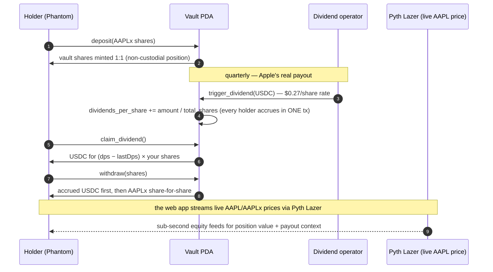

# StreamDividend — dividend streams for tokenized stocks on Solana

> **One sentence:** Hold tokenized Apple stock (AAPLx) and receive its **real
> dividend income in USDC, streamed pro-rata the moment it lands on-chain** —
> non-custodial, mainnet-live, adversarially audited.

**[Live demo](https://husseinadeiza.github.io/streamdividend-app/)** · **[Pitch video](https://husseinadeiza.github.io/streamdividend-app/videos/StreamDividend_Pitch.mp4)** · **[Technical video](https://husseinadeiza.github.io/streamdividend-app/videos/StreamDividend_TechKnowHow.mp4)** · **[Program on explorer](https://solscan.io/account/LuTgK5iC7MvcnWGeJTsXpZH6bHZ4Cf95m333U8ed9kA)** · **[Web app repo](https://github.com/HusseinAdeiza/streamdividend-app)**

`Anchor 0.29` `Rust` `Token-2022` `SPL Token v3` `USDC` `Pyth Lazer (live equity feeds)` `Next.js 14` `Solana mainnet-beta`

Built for **[Stocklana](https://hackathons.solana.com/hackathons/stocklana)** (Solana Foundation) — integrating the **Pyth Network** track's live equity price data via Pyth Lazer.

---

## The problem

Tokenized stocks already trade on Solana — but the **dividend income never
reaches the holder**. You wait on an operator, trust a middleman, or it gets
stuck in a custodial ledger. The token market is real; the cash flow is lost.

## The solution

A **non-custodial vault program**: deposit AAPLx (Token-2022 xStock backed 1:1
by real Apple shares), and every USDC dividend that lands in the vault is
applied pro-rata across all shares *in the same transaction*. Your
`dividends_per_share` accrues instantly; claim it, compound it, or withdraw your
shares at any time — paid out first, share-for-share.



## It's real — live on Solana mainnet

| | |
|---|---|
| Program ID | `LuTgK5iC7MvcnWGeJTsXpZH6bHZ4Cf95m333U8ed9kA` |
| Vault PDA | `2vsxDXuanJxrWtBzhun6yaCidHZxVNdFEobtAC3CKwM2` |
| Vault xStock ATA (AAPLx, Token-2022) | `E4qLqRdxvv1HTAS7gePCq9JMaNhE1BpXh3WUEJjezpsk` |
| Vault USDC ATA | `3khNwQmsAwXaeLZe4dWGtpEfs7FjQpjEqhPjZyeGydQg` |
| xStock mint | `XsbEhLAtcf6HdfpFZ5xEMdqW8nfAvcsP5bdudRLJzJp` (AAPLx, Token-2022) |
| USDC mint | `EPjFWdd5AufqSSqeM2qN1xzybapC8G4wEGGkZwyTDt1v` (v3) |

The demo videos are connected-wallet click-throughs with **real finalized
mainnet transactions** (e.g. deposit `5g9QVJS8…` — wallet 0.00287561 →
0.00137561 AAPLx, vault 0.009 → 0.0105). Full deployment record:
[`MAINNET.md`](MAINNET.md).

## Pyth Network integration (live equity feeds)

The web app's dashboard streams **real-time AAPL / AAPLx prices via Pyth Lazer**
(sub-second equity + crypto feed entitlements, granted through the Pyth
program): live position valuation, payout context against the actual Apple
dividend rate, and feed-health telemetry in the UI. Check script:
`scripts/pyth-check.mjs` in the [app
repo](https://github.com/HusseinAdeiza/streamdividend-app) (prints status +
prices only — the entitlement token is a build-time env var, never committed).

## Security — we audited ourselves, and it found real bugs

Before shipping, the protocol went through a genuine adversarial review
(full record: [`AUDIT.md`](AUDIT.md)):

- **HIGH — dividend-pool drain:** `withdraw` didn't pin the xStock mint; an
  attacker could swap in the USDC mint and drain the pool via the "return
  xStock" leg while corrupting accounting.
- **HIGH — deposit diversion:** `deposit` didn't pin the vault's token account;
  a malicious frontend could route a user's deposit attacker-side while
  inflating vault bookkeeping.
- **LOW — dust trigger:** a `trigger_dividend` rounding to zero per share could
  strand USDC with no rescue path.

All three were **fixed, PoC-verified blocked on the fixed binary, and the fixed
build is live on mainnet** — byte-identical ELF verified on-chain
(sha `abb733cc`, slot 448180469), 8/8 e2e green, all exploit paths re-run and
confirmed blocked. Finding and killing your own drain bug before someone else
does is the discipline this protocol ships with.

## Instructions

| Instruction | What it does |
|---|---|
| `initialize` | Create the vault account + vault token ATAs (idempotent ATA creation is done client-side) |
| `deposit` | Deposit xStock shares → mint vault shares at the current ratio |
| `trigger_dividend` | Transfer USDC dividends into the vault pool; accrue pro-rata to every share in one tx |
| `claim_dividend` | Pay the caller their accrued USDC (`dividendsPerShare − lastDps`) |
| `withdraw` | Pay accrued dividends first, then burn vault shares → return xStock at the current ratio |
| `set_route` | Holder preference for earned yield: `Stream` (USDC out to wallet, default) or `AutoCompound` (recorded preference for reinvestment) |

## Accounts

- `vault` — PDA `["vault", authority]`: holds `total_shares`, `total_xstock`
  (pool balance, raw u64), `dividends_per_share` (u128, per-share raw USDC
  including 6-decimal scale), `pool` (USDC pool balance).
- Vault token ATAs are derived with `allowOwnerOffCurve = true` (vault is a PDA).

## Why Solana (not a port — the rails make the product)

- **Token-2022**: AAPLx is a Token-2022 mint with extensions — the vault CPIs
  are dual-standard (dispatch by mint owner), something SPL-v3-only chains
  can't express.
- **One-transaction pro-rata accrual**: `dividends_per_share` math means N
  holders accrue in a single instruction — no per-holder settlement loop, no
  gas-per-claim explosion. A claim costs a fraction of a cent; on an L1 this
  product's unit economics don't close.
- **Sub-second finality + Pyth Lazer**: the "dividend lands → your share value
  updates" experience is instant. *The dividend race isn't per-quarter anymore.
  It's per-block.*

## Who uses this

- **Retail holders of tokenized equities** (xStocks on Solana) who currently
  forfeit or wait on dividend income — the direct user of the live app.
- **Tokenized-stock issuers / marketplaces** (Backed-style xStock programs):
  integrating this vault is how they answer "what happens to corporate
  actions?" — the corporate-actions handling Stocklana's brief calls out.
- **DeFi protocols on xStocks**: vault shares are themselves a composable,
  yield-bearing position (deposit AAPLx → earn a USDC stream).

## Build & test

```sh
cargo build-sbf   # toolchain: solana 1.18.26 release binaries (rustc 1.75 SBF)
anchor idl --program programs/streamdividend/src/lib.rs --write-idl target/idl/streamdividend.json
solana-test-validator --ledger /tmp/e2e_ledger --reset &
solana program deploy target/deploy/streamdividend.so --url localhost
node test_program.js   # expect: 8/8 steps passed (real Token-2022 xStock mint + v3 USDC, both invariants asserted)
```

## Files

- `programs/streamdividend/src/` — `lib.rs` (handlers), `token_ix.rs` (SPL token CPI helpers)
- `test_program.js` — end-to-end local test (8/8)
- `setup_mainnet_vault.js` — mainnet vault setup (ATA creation + initialize)
- `demo_mainnet_full.js`, `trigger_dividend_demo.js`, `demo_leave_live.js` — real mainnet demo drivers (deposit / dividend trigger / claim)
- `AUDIT.md` — adversarial audit: findings, PoCs, fixes, on-chain verification
- `MAINNET.md` — full deployment + upgrade record (ELF sizes, shas, slots)
- `Stocklana_submission.md` — hackathon submission copy
- `target/idl/streamdividend.json` — generated IDL (consumed by the web app)

## Honest disclosure

Per Stocklana rules: the vault program, web app, audit and mainnet deployment
were built during the hackathon window by the submitter. Composes existing
open-source protocols (Anchor, SPL Token / Token-2022, Pyth Lazer SDK) as
encouraged.

*The dividend race isn't per-quarter anymore. It's per-block.*
